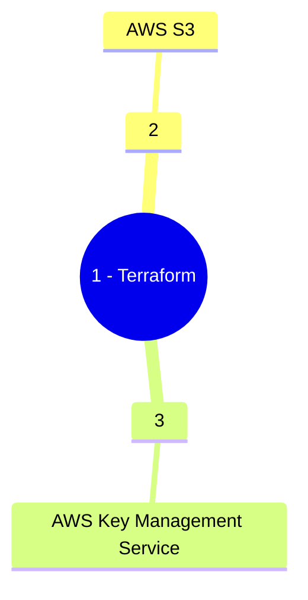

&nbsp;&nbsp;&nbsp;&nbsp;&nbsp;&nbsp;&nbsp;&nbsp;&nbsp;

# Project `<Project Name>`: `<Project Description>`

`The user / producer uploads a csv source file to the landing zone S3 bucket. A Lambda function is triggered using S3 event notification and loads it to a DynamoDB table. The entire stack is created using CFT (CloudFormation template). The SNS, S3 Bucket and DynamoDB tables are encrypted using Customer Managed KMS Key.`

## Description

`This sample project demonstrate the capability of loading a .csv file into a DynamoDB table using a Lambda function. The Lambda function is triggered using an Event Source Notification created on the S3 bucket. Once the data loads successfully into the table a SNS notification is published and end users are notified via email subscriibed to the SNS Topic. CloudWatch Alarms are created to demonstrate the different metrics on the Lambda function. The S3 Bucket, SNS Topic and the DynamoDB tables are encrypted using Customer Managed KMS Key. The entire stack (excluding the KMS Key) is created using CloudFormation templates.`


### Services Used


### Getting Started

* This repository is configured to deploy the stack in Development, Staging and Production AWS Accounts. To use the pipeline you need to have
three AWS Accounts created in an AWS Org under a Management Account (which is the best practice). The Org structure will be as follows:

```
Root
├─ Management
├─ Development
├─ Test
└─ Production
```

* Create KMS Key in each of the AWS Accounts which will be used to encrypt the resources.

* Create an OpenID Connect Identity Provider

* Create an IAM Role for OIDC and use the sample Trust Policy in each of the three AWS accounts
```
{
    "Version": "2008-10-17",
    "Statement": [
        {
            "Effect": "Allow",
            "Principal": {
                "Federated": "arn:aws:iam::<Account Id>:oidc-provider/token.actions.githubusercontent.com"
            },
            "Action": "sts:AssumeRoleWithWebIdentity",
            "Condition": {
                "StringLike": {
                    "token.actions.githubusercontent.com:sub": [
                        "repo:<GitHub User>/<GitHub Repository>:ref:refs/head/main",
                    ]
                }
            }
        }
    ]
}
```

  * Create an IAM Policy to allow CloudFormation access and attach it to the OIDC Role, using the sample policy document:
```
{
    "Version": "2012-10-17",
    "Statement": [
        {
            "Effect": "Allow",
            "Action": [
                "cloudformation:CreateStack",
                "cloudformation:DescribeStacks",
                "cloudformation:CreateChangeSet",
                "cloudformation:DescribeChangeSet",
                "cloudformation:DeleteChangeSet",
                "cloudformation:ExecuteChangeSet",
                "cloudformation:DeleteStack"
            ],
            "Resource": "*"
        }
    ]
}
```

  * Create an IAM Policy to allow creation and deletion of resources  and attach it to the OIDC Role, using the following sample policy document:
```
{
    "Version": "2012-10-17",
    "Statement": [
        {
            "Sid": "AllowS3Access",
            "Effect": "Allow",
            "Action": [
                "s3:PutObject",
                "s3:GetObject",
                "s3:CreateBucket",
                "s3:PutObjectTagging",
                "s3:PutBucketPublicAccessBlock",
                "s3:PutBucketAcl",
                "s3:DeleteObject",
                "s3:DeleteBucket",
                "s3:ListBucket",
                "s3:PutBucketTagging",
                "s3:GetBucketTagging",
                "s3:GetBucketPolicy",
                "s3:GetBucketAcl",
                "s3:GetObjectAcl",
                "s3:GetObjectVersionAcl",
                "s3:PutObjectAcl",
                "s3:PutObjectVersionAcl",
                "s3:GetBucketCORS",
                "s3:PutBucketCORS",
                "s3:GetBucketWebsite",
                "s3:GetBucketVersioning",
                "s3:GetAccelerateConfiguration",
                "s3:GetBucketRequestPayment",
                "s3:GetBucketLogging",
                "s3:GetLifecycleConfiguration",
                "s3:GetReplicationConfiguration",
                "s3:GetEncryptionConfiguration",
                "s3:GetBucketObjectLockConfiguration",
                "s3:GetBucketOwnershipControls",
                "s3:GetObjectTagging",
                "s3:GetBucketNotification",
                "s3:PutEncryptionConfiguration",
                "s3:PutBucketOwnershipControls",
                "s3:PutBucketNotification",
                "s3:ListBucketVersions",
                "s3:PutObjectTagging",
                "s3:PutBucketVersioning"
            ],
            "Resource": "*"
        },
        {
            "Sid": "IAMAccess",
            "Effect": "Allow",
            "Action": [
                "iam:GetRole",
                "iam:CreateRole",
                "iam:DeleteRolePolicy",
                "iam:PutRolePolicy",
                "iam:DeleteRole",
                "iam:PassRole",
                "iam:TagRole",
                "iam:CreatePolicy",
                "iam:ListRolePolicies",
                "iam:GetPolicy",
                "iam:ListAttachedRolePolicies",
                "iam:GetPolicyVersion",
                "iam:ListInstanceProfilesForRole",
                "iam:AttachRolePolicy",
                "iam:DetachRolePolicy",
                "iam:ListPolicyVersions",
                "iam:DeletePolicy",
                "iam:UntagRole",
                "iam:GetRolePolicy"
            ],
            "Resource": "*"
        },
        {
            "Sid": "LambdaCreateAccess",
            "Effect": "Allow",
            "Action": [
                "lambda:GetFunction",
                "lambda:DeleteFunction",
                "lambda:CreateFunction",
                "lambda:TagResource",
                "lambda:InvokeFunction",
                "lambda:PutFunctionConcurrency",
                "lambda:CreateFunction",
                "lambda:ListVersionsByFunction",
                "lambda:GetFunctionCodeSigningConfig",
                "lambda:PutFunctionEventInvokeConfig",
                "lambda:AddPermission",
                "lambda:GetFunctionEventInvokeConfig",
                "lambda:GetPolicy",
                "lambda:DeleteFunctionEventInvokeConfig",
                "lambda:RemovePermission",
                "lambda:ListTags",
                "lambda:UpdateFunctionConfiguration"
            ],
            "Resource": "*"
        },
        {
            "Sid": "SQSCreateAccess",
            "Effect": "Allow",
            "Action": [
                "sqs:GetQueueAttributes",
                "sqs:ListQueueTags",
                "sqs:CreateQueue",
                "sqs:TagQueue",
                "sqs:SetQueueAttributes",
                "sqs:SendMessage",
                "sqs:DeleteQueue"
            ],
            "Resource": "*"
        },
        {
            "Sid": "SNSCreateAccess",
            "Effect": "Allow",
            "Action": [
                "SNS:GetTopicAttributes",
                "SNS:ListTagsForResource",
                "SNS:GetSubscriptionAttributes",
                "SNS:CreateTopic",
                "SNS:TagResource",
                "SNS:SetTopicAttributes",
                "SNS:DeleteTopic",
                "SNS:Subscribe",
                "SNS:Unsubscribe"
            ],
            "Resource": "*"
        },
        {
            "Sid": "DynamoDBAccess",
            "Effect": "Allow",
            "Action": [
                "dynamodb:DescribeTable",
                "dynamodb:DescribeContinuousBackups",
                "dynamodb:DescribeTimeToLive",
                "dynamodb:ListTagsOfResource",
                "dynamodb:CreateTable",
                "dynamodb:TagResource",
                "dynamodb:DeleteTable"
            ],
            "Resource": "*"
        },
        {
            "Sid": "KMSKeyAccess",
            "Effect": "Allow",
            "Action": [
                "kms:Encrypt",
                "kms:Decrypt",
                "kms:DescribeKey"
            ],
            "Resource": [
                "arn:aws:kms:<AWS Region>:<AWS Account Id>:key/<KMS Key Id>"
            ]
        },
        {
            "Sid": "CloudWatchAccess",
            "Effect": "Allow",
            "Action": [
                "cloudwatch:PutMetricAlarm",
                "cloudwatch:DescribeAlarms",
                "cloudwatch:ListTagsForResource",
                "cloudwatch:DeleteAlarms",
                "cloudwatch:TagResource"
            ],
            "Resource": "*"
        },
        {
            "Sid": "StateMachineAccess",
            "Effect": "Allow",
            "Action": [
                "states:CreateStateMachine",
                "states:TagResource",
                "states:DescribeStateMachine",
                "states:DeleteStateMachine"
            ],
            "Resource": "*"
        },
        {
            "Sid": "CWLogGroupAccess",
            "Effect": "Allow",
            "Action": [
                "logs:CreateLogGroup",
                "logs:TagResource",
                "logs:PutRetentionPolicy",
                "logs:DescribeLogGroups",
                "logs:DeleteLogGroup"
            ],
            "Resource": "*"
        },
        {
            "Sid": "EventBridgeAccess",
            "Effect": "Allow",
            "Action": [
                "events:TagResource",
                "events:CreateEventBus",
                "events:DeleteEventBus",
                "events:PutRule",
                "events:DescribeRule",
                "events:PutTargets",
                "events:RemoveTargets",
                "events:DeleteRule"
            ],
            "Resource": "*"
        },
        {
            "Sid": "SSMParamAccess",
            "Effect": "Allow",
            "Action": [
                "ssm:GetParameters"
            ],
            "Resource": "*"
        },
        {
            "Sid": "EC2Access",
            "Effect": "Allow",
            "Action": [
                "ec2:DescribeImages",
                "ec2:CreateInternetGateway",
                "ec2:CreateVpc",
                "ec2:CreateSubnet",
                "ec2:CreateTags",
                "ec2:CreateRouteTable",
                "ec2:CreateRoute",
                "ec2:CreateSecurityGroup",
                "ec2:DescribeInternetGateways",
                "ec2:DescribeVpcs",
                "ec2:DescribeAccountAttributes",
                "ec2:DescribeRouteTables",
                "ec2:DescribeSubnets",
                "ec2:DescribeAvailabilityZones",
                "ec2:DescribeSecurityGroups",
                "ec2:DeleteVpc",
                "ec2:DeleteSubnet",
                "ec2:DeleteRouteTable",
                "ec2:DeleteRoute",
                "ec2:DeleteSecurityGroup",
                "ec2:DeleteInternetGateway",
                "ec2:ModifyVpcAttribute",
                "ec2:AttachInternetGateway",
                "ec2:DetachInternetGateway",
                "ec2:AssociateRouteTable",
                "ec2:ModifySubnetAttribute",
                "ec2:DisassociateRouteTable",
                "ec2:AuthorizeSecurityGroupIngress",
                "ec2:RunInstances",
                "ec2:TerminateInstances",
                "ec2:DescribeInstances"
            ],
            "Resource": "*"
        },
        {
            "Sid": "Route53Access",
            "Effect": "Allow",
            "Action": [
                "route53:GetHostedZone",
                "route53:GetChange",
                "route53:ChangeResourceRecordSets",
                "route53:ListResourceRecordSets",
                "route53:ListHostedZones"
            ],
            "Resource": "*"
        }
    ]
}
```

### Installing

* The repository directory structure should be as follows:
```
Root
├─ Management
├─ Development
├─ Test
└─ Production
```
* Clone the repository.
* Create a S3 bucket to used a code repository.
* Modify the params/*.terraform.tfvars files
    * devl.terraform.tfvars -> Parameters for Devl
    * test.terraform.tfvars -> Parameters for Test
    * prod.terraform.tfvars -> Parameters for Prod

* Create the following GitHub repository Secrets:


|Secret Name|Secret Value|
|-|-|
|AWS_REGION|```us-east-1```|
|DEVL_AWS_KMS_KEY_ARN|```arn:aws:kms:<AWS Region>:<Development Account Id>:key/<KMS Key Id in Development>```|
|TEST_AWS_KMS_KEY_ARN|```arn:aws:kms:<AWS Region>:<Test Account Id>:key/<KMS Key Id in Test>```|
|PROD_AWS_KMS_KEY_ARN|```arn:aws:kms:<AWS Region>:<Production Account Id>:key/<KMS Key Id in Production>```|
|DEVL_AWS_ROLE_ARN|```arn:aws:iam::<Development Account Id>:role/<OIDC IAM Role Name>```|
|TEST_AWS_ROLE_ARN|```arn:aws:iam::<Test Account Id>:role/<OIDC IAM Role Name>```|
|PROD_AWS_ROLE_ARN|```arn:aws:iam::<Production Account Id>:role/<OIDC IAM Role Name>```|
|DEVL_AWS_TF_STATE_BUCKET_NAME|```<Terraform State S3 Bucket in Development>```|
|TEST_AWS_TF_STATE_BUCKET_NAME|```<Terraform State S3 Bucket in Test>```|
|PROD_AWS_TF_STATE_BUCKET_NAME|```<Terraform State S3 Bucket in Production>```|

### Executing the CI/CD Pipeline

* Create Create a feature branch and push the code.
* The CI/CD pipeline will create a build and then will deploy the stack to devlopment.
* Once the Stage and Prod deployment are approved (If you have configured with protection rule ) the stack will be reployed in the respective environments

## Help

:email: Subhamay Bhattacharyya  - [subhamay.aws@gmail.com]


## Authors

Contributors names and contact info

Subhamay Bhattacharyya  - [subhamay.aws@gmail.com]

## Version History

* 0.1
    * Initial Release

## License

This project is licensed under Subhamay Bhattacharyya. All Rights Reserved.

## Acknowledgments
